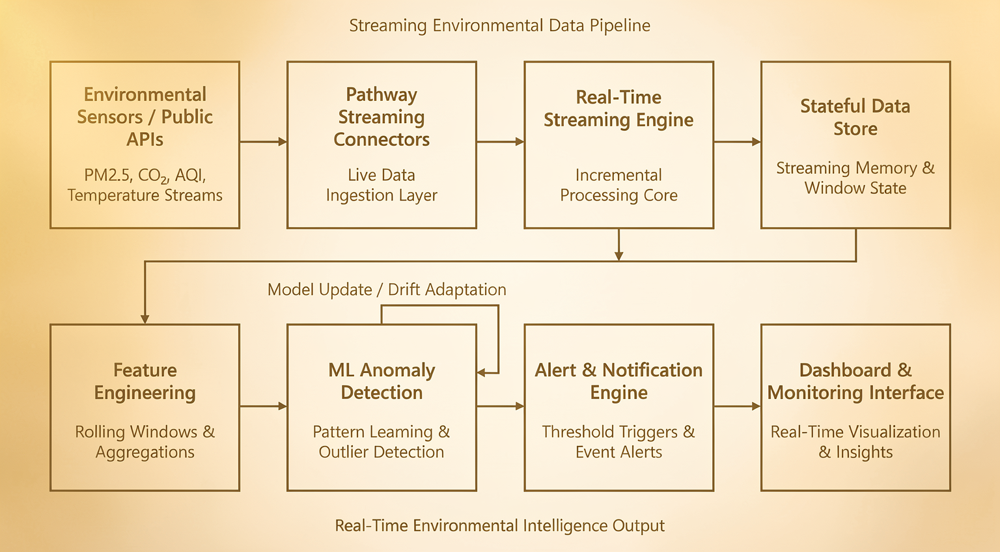

# Live Environmental Intelligence Engine


---

• Event-Driven • Incremental •Drift-Aware • Streaming-Native • Container-Ready

---

> A real-time streaming anomaly detection prototype for environmental monitoring.

> Built using Pathway and IsolationForest with adaptive retraining for drift-aware modeling.

>This repository contains the adaptive streaming anomaly detection core of the proposed environmental intelligence platform.

---

## ◼ Problem Statement

Environmental monitoring systems collect massive volumes of real-time pollution and sensor data (PM2.5, CO₂, temperature, AQI), many traditional monitoring workflows rely on:

- Batch-based processing
- Static threshold alerts
- Manual anomaly review
- Delayed response cycles

These systems fail under seasonal drift, industrial variation, and changing environmental baselines. The problem is not data availability — it is real-time intelligent processing and adaptive detection. This project addresses the system design gap between environmental risk and response.

---

## ◻ System Architecture

<p align="center">
  
</p>

---

High-level architecture follows event-driven, incremental computation principles with no batch reprocessing:

- **Input Layer:** Environmental sensors (simulated IoT stream)
- **Streaming Layer:** Pathway streaming connectors, event-driven ingestion, and incremental stream processing
- **State Layer:** Sliding window buffer with in-memory state management
- **ML Layer:** IsolationForest anomaly detection with a periodic retraining pipeline
- **Output Layer:** Real-time anomaly alerts (console)

---

## ◈ Current Implementation Scope

This Repository implements:
- Simulated streaming ingestion
- Sliding-window state management
- IsolationForest anomaly detection
- Periodic adaptive retraining
- Console-based alerting
- Dockerized execution

Not yet implemented:
- Live IoT sensor ingestion
- Persistent storage
- Web dashboard
- Real-time React dashboard
- Benchmark evaluation suite
- Regulatory mapping layer

---

## ◉ Retraining Strategy (Drift Handling)

Environmental data experiences concept drift due to seasonal variation, industrial activity, weather changes, and long-term environmental shifts. The model is not static. It adapts to gradual environmental baseline shifts using:

- A sliding window of the last `BUFFER_SIZE` readings
- Initial baseline training after window fill
- Retraining every `RETRAIN_INTERVAL` samples
- IsolationForest refitted on the current window

This allows adaptive modeling without full historical retraining. The system is drift-aware by design.

Additionally, Retraining uses only the current sliding window, ensuring bounded memory usage and responsiveness to recent environmental conditions.

---

## ◌ Drift Simulation

The simulator generates realistic environmental patterns using:

- Small random noise per tick
- Gradual baseline drift (`DRIFT_RATE`)
- Occasional correlated multi-feature spikes
- Value clamping to realistic ranges

Correlated spikes affect multiple features simultaneously (PM2.5 + CO₂ + temperature), making anomaly detection more realistic than single-feature thresholds. This ensures detected anomalies correspond to meaningful correlated deviations rather than isolated statistical noise.

---

## ⌘ Configuration Table

The system is highly configurable via the centralized config module (`src/config.py`).

| Parameter | Description |
| :--- | :--- |
| `BUFFER_SIZE` | Sliding window size for adaptive state |
| `RETRAIN_INTERVAL` | Number of samples before retraining |
| `CONTAMINATION` | Expected anomaly fraction for IsolationForest |
| `SPIKE_PROBABILITY` | Probability of simulated anomaly event |
| `DRIFT_RATE` | Gradual baseline drift in simulation |
| `SLEEP_INTERVAL` | Delay between generated readings |

---

## ▣ Example Output

```text
[17:44:36] ALERT: environmental anomaly detected
```
<p align="center">
  
</p>

---

## ⬢ Installation

### Local Setup

```bash
git clone <repo-url>
cd live-environmental-intelligence-engine

# create and activate virtualenv
python3 -m venv venv
source venv/bin/activate

# install dependencies
pip install --upgrade pip
pip install -r requirements.txt

# run the streaming engine
python -m src.main
```

### ⬡ Docker Setup

```bash
docker build -t environmental-engine .
docker run environmental-engine
```

---

## ⌁ Running Tests

```bash
pytest
```

---

## ∴ Design Decisions

- **Why IsolationForest?** Effective for unsupervised multi-variate anomaly detection without needing labeled training data.
- **Why sliding window instead of full history?** Maintains bounded memory usage and ensures the model adapts to recent environmental baselines instead of being anchored by stale historical data.
- **Why Pathway as the streaming engine?** Pathway enables incremental recomputation, avoiding full-batch reprocessing and allowing stateful streaming in pure Python. <br/>
Enables event-driven, incremental processing in Python natively without the architectural overhead of heavy JVM-based frameworks.
- **Why configuration file separation?** Centralizes parameters to make experimentation and drift tuning reproducible and clean.

---

## ∵ Limitations

- Current data source is simulated (not real sensor hardware)
- State is memory-resident (no persistence layer yet)
- IsolationForest is unsupervised and may produce false positives under extreme drift
- No performance benchmarking results included in this version
- No visualization/dashboard layer

---

## ◍ Validation & Benchmarking Roadmap

Future validation stages include:
- Latency measurement under load
- Precision/recall benchmarking
- False positive rate comparison vs static thresholds
- Stress testing under high-volume event streams

---

## ⟁ Future Extensions

**Near-Term:**
- REST API exposure for alerts
- Real-time React dashboard
- Persistent streaming state

**Mid-Term:**
- LSTM time-series modeling
- Multi-model ensemble detection
- Context-aware anomaly summaries

**Long-Term Vision:**
- Multi-city environmental rollout
- Industrial compliance support
- Disaster early warning extension
- National environmental intelligence platform

---

## ◧ Project Structure

```text
src/
  __init__.py
  main.py
  anomaly_model.py
  data_simulator.py
  config.py
tests/
Dockerfile
requirements.txt
README.md
```

---

## 📄 License

MIT License.
